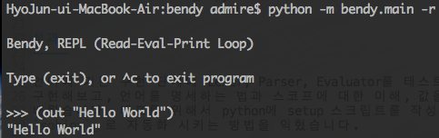
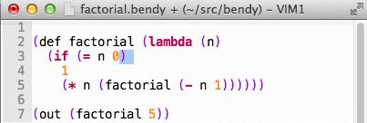
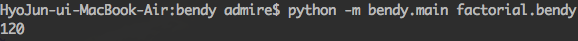

Bendy
=========

-------

기간
    2010.07 -- 2010.08

프로젝트 소개
    SW Maestro 연수 과정에서 진행한 LISP을 Python으로 구현한 연구 프로젝트
    입니다. SICP 책의 내용을 기본으로 언어의 구현 과정을 습득하고 스코프를
    이해할 수 있었습니다. 오픈소스로 진행되었기때문에 개발 과정과 소스코드를
    `Bitbucket repository`_ (http://bitbucket.org/admire93/bendy)
    에서 보실 수 있습니다.

.. _Bitbucket repository: http://bitbucket.org/admire93/bendy

사용 기술
-----------

- 언어: Python
- 라이브러리: `sphinx`_ (python 문서화 도구)

성과
-----

언어에 기본 구현 단계에 Lexer, Parser, Evaluator를 테스트 케이스와 함께
구현해보고, 언어를 명세하는 법과 스코프에 대한 이해, 값을 평가하는 다른 방법을
배웠습니다. 배포를 위해서 python에 setup 스크립트를 작성하고 문서화를
`sphinx`_ 로 자동화 시키는 방법을 익혔습니다.

.. _sphinx: http://sphinx-doc.org/

실행 모습
-----------

REPL 실행 모습

프로그램 실행 모습

