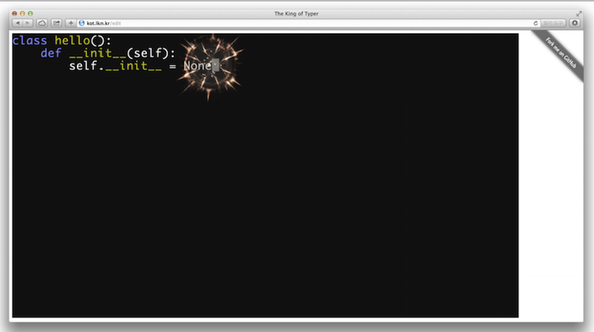

==================
King of typer
==================

-------

기간
    2013.06

프로젝트 소개
    한이음 해커톤 행사에서 개발한 에디터입니다. python 코딩을 재밌는 효과와
    함께 코딩할 수 있도록 만들었습니다. `레파지트리`_ 에서 코드를 확인하실 수
    있고 `kot.lkn.kr`_ 에서 서비스 중입니다.

.. _`레파지트리`: https://github.com/pharmaceutical-company/The-King-of-Typer
.. _`kot.lkn.kr`: http://kot.lkn.kr

사용 기술
-----------

- 언어: Javascript, html

팀 구성과 역할
----------------

- 4인 팀 구성
- lexer 구현 및 syntax highlight 에 필요한 엔진 구현

실행 모습
----------------

