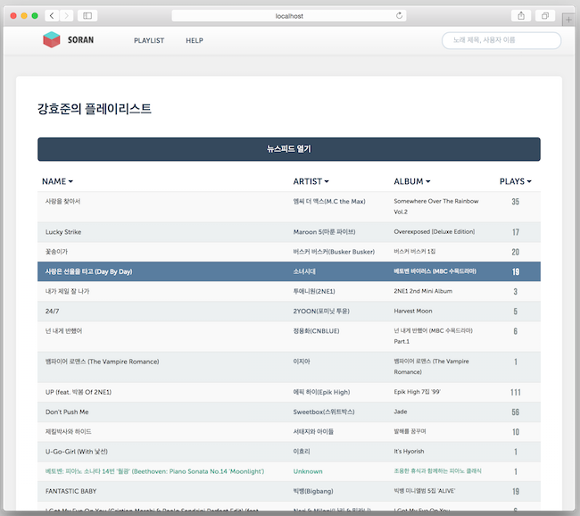

======
soran
======

-------

기간
    2013.04 -- 2013.07

프로젝트 소개
    소란은 구글 크롬 확장 기능을 통해 자신이 웹플레이어로 듣는 노래의 기록을
    남기는 서비스입니다. 처음 기능을 기획하고 구현할때 mintpresso의 데모
    프로젝트로 만들자고 결정하게되어, 노래의 기록을 남기거나 아티스트, 앨범 정보
    등을 저장할때 mintpressod에 저장합니다. 현재 서비스는 하고있지않지만,
    코드는 `레파지트리`_ (http://github.com/admire93/soran) 에 저장하고
    있습니다.

.. _레파지트리: http://github.com/admire93/soran

사용 기술
-----------

- 언어: Scala, Javascript
- 디비: mintpresso
- 프레임워크: Play! framework
- 라이브러리: d3
- chrome extension 개발

팀 구성과 역할
----------------

- 개인 개발 프로젝트
- 프론트 개발 및 서버 개발

성과
---------

자신뿐만 아니라 친구들이 듣는 노래를 기록하고, 도표로 만들어서
친구들이 좋아하는 노래나 아티스트를 한눈에 볼 수 있어서 좋았습니다.

실행 모습
----------------

